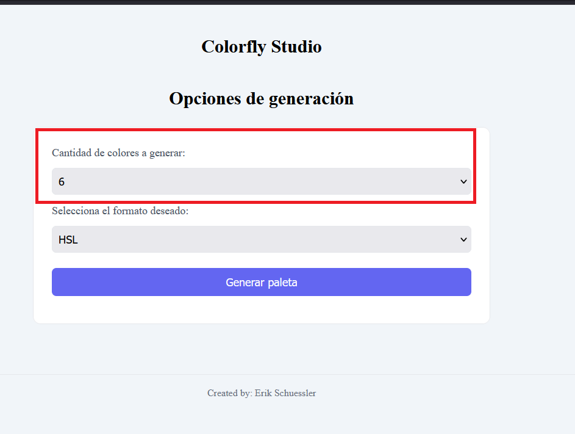
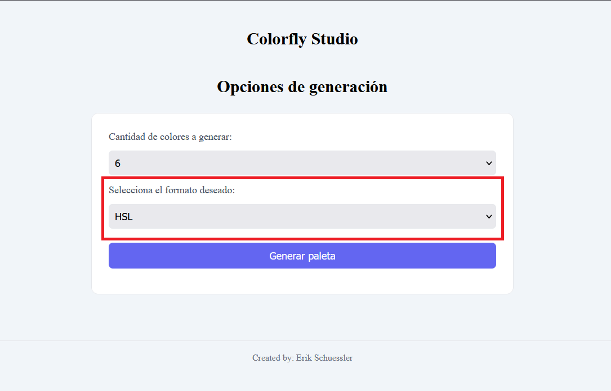
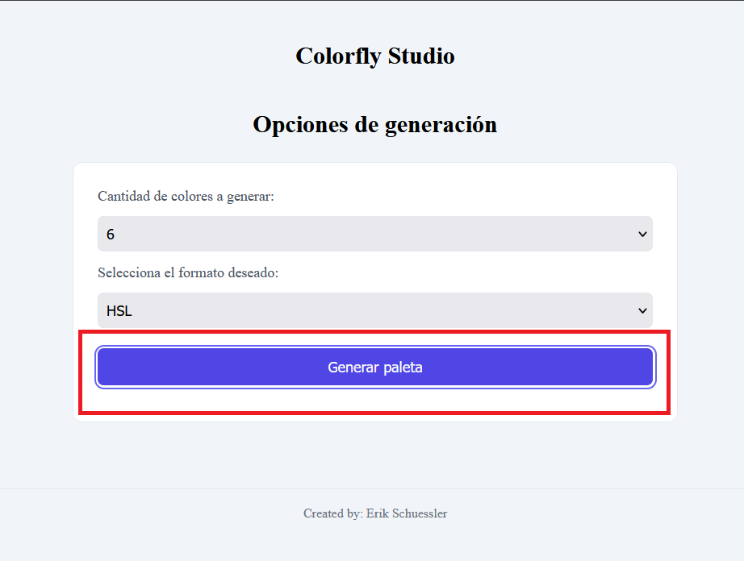
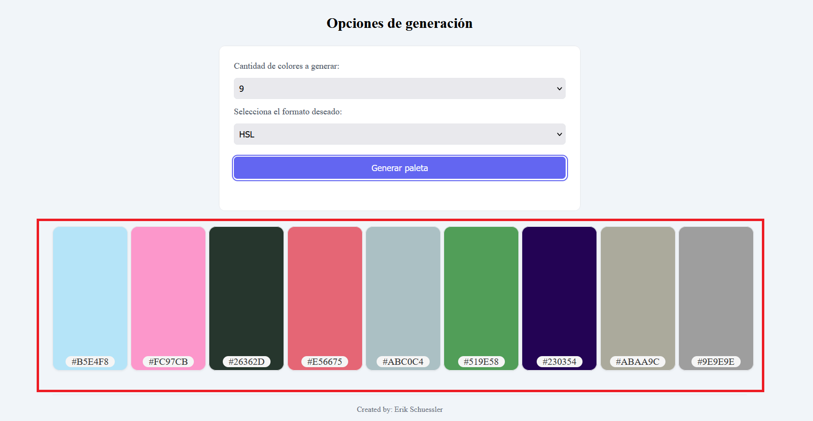
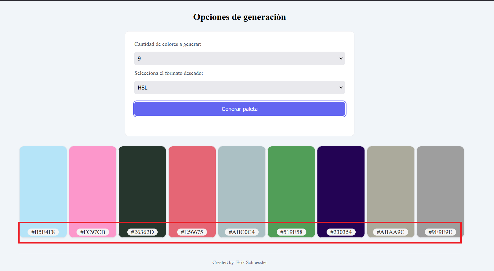
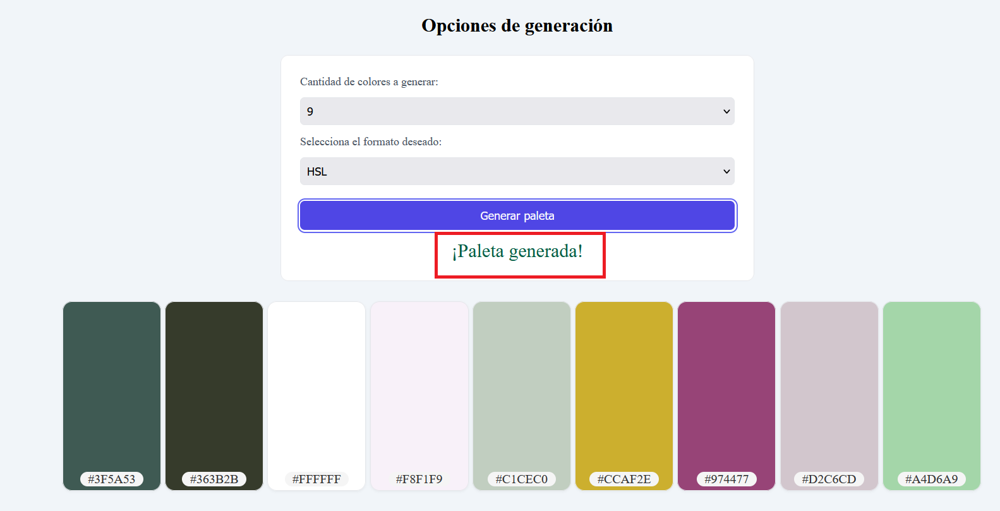

# 🎨 Colorfly Studio - Color Palette Generator

Aplicación web interactiva que permite generar paletas de colores aleatorias en formato HSL o HEX.

El usuario puede seleccionar la cantidad de colores (6, 8 o 9) y visualizar cada color junto a su código HEX.

---

## 🚀 Demo

👉 [Ver pagina web](https://brainspeck.github.io/ProyectoM1_Erik-Malo-Schuessler/)

---

## 🛠️ Tecnologías

- HTML5
- CSS3
- JavaScript (Vanilla)

---

## ⚙️ Funcionalidades

- Generación de paletas de colores aleatorias
- Selección de cantidad de colores (6, 8 o 9)
- Soporte para formato HSL y HEX
- Render dinámico de cards
- Microfeedback al generar paleta

---

## 🧠 Decisiones técnicas

- Se utilizó HSL para generar colores, ya que permite controlar mejor la saturación y luminosidad.
- Se implementó conversión manual de HSL a HEX pasando por RGB.
- Se evitó el uso de estilos inline, utilizando JavaScript para manejar estilos dinámicos.
- Se utilizó CSS Grid para la disposición de las cards.
- Se separó la lógica de generación de colores en funciones reutilizables.

---

## 📦 Instalación

1. Clonar el repositorio:

    ```bash
    git clone https://github.com/Brainspeck/ProyectoM1_Erik-Malo-Schuessler.git
    ```

2. Acceder a la carpeta del proyecto:

    ```bash
    cd ProyectoM1_Erik-Malo-Schuessler
    ```

3. Ejecutar:

    Abrir el archivo `index.html` en el navegador.

---

## 📘 Manual de usuario

### 1. Seleccionar la cantidad de colores

El usuario puede elegir cuántos colores desea generar en la paleta.  
Las opciones disponibles son 6, 8 o 9 colores.



---

### 2. Elegir el formato de color

Selecciona el formato en el que deseas trabajar:

- HSL
- HEX



---

### 3. Generar la paleta

Haz clic en el botón **“Generar paleta”** para crear una nueva combinación de colores.



---

### 4. Visualizar los colores generados

La aplicación mostrará la paleta con los colores generados en forma de tarjetas.



---

### 5. Consultar el código HEX

Debajo de cada color se muestra su código en formato HEX.



---

### 6. Feedback visual

Cada vez que se genera una nueva paleta, se muestra un mensaje de confirmación.



---


## ✍️ Autor

Erik Schuessler